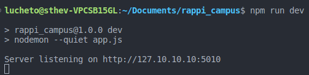
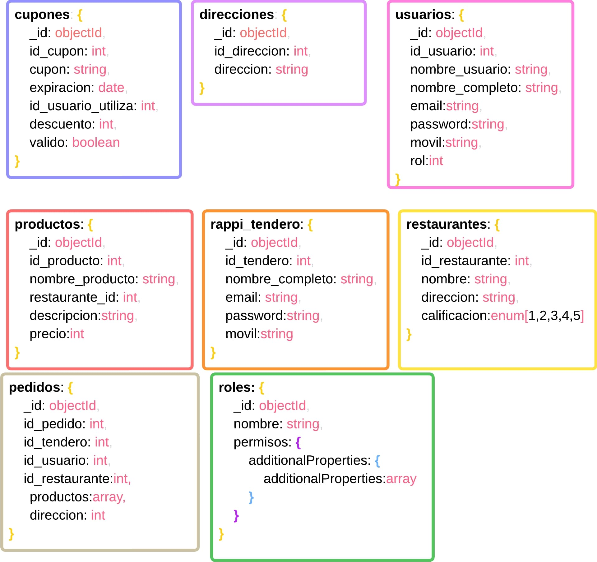

Rappi es una aplicación movil donde puedes ser o un usuario para realizar pedidos, una empresa para vender tus productos o un rapitendero para realizar los domicilios de los productos de la empresa al domicilio del usuario que lo pidio.


## Objetivo especifico

Este proyecto tiene como objetivo simular la funcionalidad de la aplicación de rappi, enfocándose principalmente en la funcionalidad de pedidos que esta aplicación posee. Implementando a su paso conceptos vistos como **JSON Web Token**, **MongoDB**, **Express**, entre otros. Este proyecto permitirá (según los roles establecidos) acceder a los endpoints de cupones, direcciones, pedidos, productos, restaurantes,  tenderos y usuarios. Más adelante estará la especificación para cada endpoint.

#### ¿Como funciona Rappi?

1. **Aplicación Móvil y Plataforma Web:** Rappi opera a través de una aplicación móvil para dispositivos iOS y Android, así como una plataforma web. Los usuarios pueden descargar la aplicación, registrarse y comenzar a usarla para realizar pedidos de productos y servicios.
2. **Registro y Autenticación:** Los usuarios se registran en la aplicación proporcionando su información personal y detalles de pago. Una vez registrados, pueden autenticarse para acceder a la plataforma.
3. **Exploración y Pedido de Productos**: Los usuarios pueden explorar una amplia variedad de categorías de productos, como alimentos, medicamentos, supermercado, productos de cuidado personal, entre otros. Pueden seleccionar productos específicos y agregarlos a su carrito de compras.
4. **Gestión de Pedidos**: Una vez que los usuarios han agregado todos los productos que desean comprar a su carrito, pueden proceder a realizar el pedido. Aquí es donde comienza el proceso de gestión de pedidos.
5. **Asignación de Entregas**: Una vez que se realiza un pedido, el sistema asigna a un repartidor (conocidos como "Rappitenderos") para recoger los productos de las tiendas asociadas y entregarlos al cliente. La asignación puede basarse en la ubicación, la disponibilidad del repartidor y otros factores.
6. **Rastreo en Tiempo Real**: Los usuarios pueden rastrear el progreso de su pedido en tiempo real a medida que el repartidor se acerca a su ubicación. Esto proporciona una experiencia transparente y actualizada sobre el estado del pedido.
7. **Pago y Calificación**: Una vez que se completa la entrega, los usuarios pueden realizar el pago a través de la aplicación, utilizando los métodos de pago que hayan configurado previamente. Después de la entrega, también tienen la opción de calificar y dejar comentarios sobre la experiencia.
8. **Integración con Establecimientos**: Rappi trabaja en colaboración con una variedad de establecimientos, como restaurantes, supermercados y farmacias. Estos establecimientos proporcionan sus catálogos de productos y servicios a Rappi, que luego están disponibles para los usuarios en la aplicación.
9. **Optimización de Rutas y Logística**: El sistema de Rappi debe ser eficiente en la asignación de repartidores y la planificación de rutas para garantizar entregas rápidas y precisas. Esto implica tecnologías de geolocalización y algoritmos de optimización de rutas.
10. **Atención al Cliente**: Rappi también ofrece atención al cliente a través de la aplicación y otros canales para resolver problemas, responder preguntas y brindar asistencia en caso de problemas con pedidos.

Además de eso Rappi tiene muchas otras funcionalidades tales como:

-  RappiCreditos
- RappiPay
- RappiCash
- RappiFavor

- ##### ¿Qué es un sistema marketplace?

El Marketplace es un sitio donde los productos son ofrecidos por los comerciantes para ser adquiridos por consumidores, es decir, un mercado en el mundo online. En él, varios comerciantes colocan sus productos a la venta en un sólo canal.


## Instrucciones de uso

#### Instalación de Nodejs con nvm
Para usar este proyecto después de descargarlo asegúrate de estar usando la version `18.16.1` de `nvm`, para eso vas a mandar el siguiente comando en la terminal.

```
nvm install 18.16.1
```

Ahora vas a poner la version en uso con el siguiente comando.

```
nvm use 18.16.1
```

#### Variables de entorno

Para las variables de entorno tienes el archivo `.env.example`, en ese archivo solo debes llenar los espacios vacíos con los datos correspondientes y luego renombrar el archivo eliminando la parte `.example`, dejando unicamente el `.env`.

Nota: *Se utiliza el nombre por defecto del Cluster de mongo siendo este 'cluster0' si su Cluster tiene un nombre diferente debe cambiar el nombre en la conexión de mongo.*

#### Instalación de dependencias

Para descargar las dependencias utilizadas en el proyecto vas utilizar el siguiente comando.

```
npm install
```

Una vez descargadas las dependencias para asegurarte de que todo quedo bien vas a arrancar el `nodemon` con el siguiente comando

```
npm run dev
```

Si todo esta bien debería darte la siguiente respuesta. Indicando que el servidor se encuentra activo.



#### Base de datos

##### Esquema:


Para generar la base de datos primero debes entrar a mongoDB Atlas y copar el link de conexión por string, y lo vas a pegar en el archivo `atlas.js`, cambiando la constante llamada `uri` por las partes correspondientes en las variables de entorno.

El archivo lo encuentras en la siguiente dirección `/config/connection/atlas.js`

Ahora con la extension `MongoDB for VS Code` vas a conectarlo con Atlas.

Ahora vas a ir al script de la base de datos que esta en `config/db/schema.mongodb` y  vas a ejecutar todo el script. 

### Tokens

Para manipular los endpoints siempre vas a tener que generar el token correspondiente, el endpoint para generar tokens es el siguiente.

Nota: *Para generar el token debes generar una consulta POST.*
```
http://127.10.10.10:5010/login
```


También tienes que enviar por el body un email y contraseña de algun usuario existente en la base de datos, como por ejemplo


```
{
  "email": "sebas23@gmail.com",
  "password": "sebas23123"
}
```
Ese token lo vas a pegar en los headers y vas a activar la opcion `Authorization`.

para generar un token de admin tendrias que mandar el siguiente json.
```
{
  "email": "admin@system.com",
  "password": "admin123"
}
```
Con el token de admin puedes manipular la informacion de todas las colecciones, con el de usuarios solo puedes consultar 4 colecciones. 

### Endpoints

Aqui te voy a listar todos los endpoinst que tienes disponibles con su metodo, recuerda que solo con el token de admin puedes usarlos todos.

#### CRUD y version `1.0.0`

Para manipular el CRUD de todas las colecciones tienes que primero seleccionar la version 1.0.0, eso lo pondras en los headers como el token pero esta vez activaras la opción `Accept-Version`.

Los enpoints del CRUD son los siguientes.

#### GET

```
http://127.10.10.10:5010/usuarios
http://127.10.10.10:5010/restaurantes
http://127.10.10.10:5010/productos
http://127.10.10.10:5010/tenderos
http://127.10.10.10:5010/cupones
http://127.10.10.10:5010/direcciones
http://127.10.10.10:5010/pedidos
```
#### POST

```
http://127.10.10.10:5010/usuarios
http://127.10.10.10:5010/restaurantes
http://127.10.10.10:5010/productos
http://127.10.10.10:5010/tenderos
http://127.10.10.10:5010/cupones
http://127.10.10.10:5010/direcciones
http://127.10.10.10:5010/pedidos
```
#### PUT

```
http://127.10.10.10:5010/usuarios/:id
http://127.10.10.10:5010/restaurantes/:id
http://127.10.10.10:5010/productos/:id
http://127.10.10.10:5010/tenderos/:id
http://127.10.10.10:5010/cupones/:id
http://127.10.10.10:5010/direcciones/:id
http://127.10.10.10:5010/pedidos/:id
```
#### DELETE

```
http://127.10.10.10:5010/usuarios/:id
http://127.10.10.10:5010/restaurantes/:id
http://127.10.10.10:5010/productos/:id
http://127.10.10.10:5010/tenderos/:id
http://127.10.10.10:5010/cupones/:id
http://127.10.10.10:5010/direcciones/:id
http://127.10.10.10:5010/pedidos/:id
```
### Parámetros

##### usuarios

````json
{
  "user": "Conejito2000",
  "name": "Oscar Felipe Martinez Pedraza",
  "email_user": "puppy05@hotmail.com",
  "password_user": "puppy053",
  "movil_number": "+573164379245",
  "level": 2
}
````

##### productos

````json
{
  "name":"Mute",
  "restaurant_id":1,
  "description": "Mute super hipermega bueno, de la Tienda el pancho, un platado de lo que necesitas",
  "price": 10000
}
````

##### tenderos

````json
{
  "name":"Pepe Elvis Salcedo Martinez",
  "email_tendero":"Elvis@gmail.com",
  "password_tendero":"Elvis0001",
  "movil_number":"+573156794374"
}
````

##### restaurantes

````json
{
  "name":"Tienda Alfon Cito",
  "address":"Transversal 30B",
  "qualification":5
}
````

##### cupones

````json
{
  "cupon": "MIGUELM3",
  "expiration": "2023-08-31T23:59:59Z",
  "discount": 40,
  "validation": true
}
````

##### direcciones

````json
{
  "usuario_id": 10,
  "direccion": "Carrera 13 # 34-56, Bucaramanga, Santander"
}
````

##### pedidos

````json
{
  "id_restaurant": 4,
  "id_seller": 4,
  "id_user": 2,
  "products": [5],
  "address":2
}
````


### Consultas especiales y version `2.0.0`

Para las consultas especiales tienes que habilitar la version 2.0.0.

Este enpoint es de metodo `GET` y lo que devuelve son unicamente los cupones validos.
```
http://127.10.10.10:5010/cupones
```

Este enpoint es de metodo `GET` y lo que devuelve son los cupones usados por un usuario en especifico, se le debe pasar el id del usuario por el parametro 'id'.
```
http://127.10.10.10:5010/cupones/por/:id
```

Este enpoint es de metodo `GET` y lo que devuelve es la informacion del tendero que realizara un pedido en especifico, se busca por el id del pedido en el parametro 'id'.
```
http://127.10.10.10:5010/pedidos/tendero/:id
```


Este enpoint es de metodo `GET` y lo que devuelve es la informacion de los pedidos realizados por un usuario en especifico, el id de usuario se pasa en el parametro 'id'.
```
http://127.10.10.10:5010/pedidos/:id
```

Este enpoint es de metodo `GET`, pero tienes que pasarle por el body el nombre de un restaurante y te devolvera la informacion de ese restaurante en especifico.

json de ejemplo.

```
{
  "name": "Tienda Don Pancho"
}
```
enpoint
```
http://127.10.10.10:5010/restaurantes
```

Este enpoint es de metodo `GET` y lo que devuelve son todos los restaurantes pero con la informacion de todos sus productos.
```
http://127.10.10.10:5010/restaurantes/productos
```

Este enpoint es de metodo `GET` y es para filtrar restaurantes por la calificacion, como por ejemplo, restaurantes con una calificacion de 4 estrellas.
```
http://127.10.10.10:5010/restaurantes/por/:qualification
```


#### Colaboradores

- latinoamericacampus233@gmail.com

#### Autores

- John Gonzáles 

- Luis Rueda

